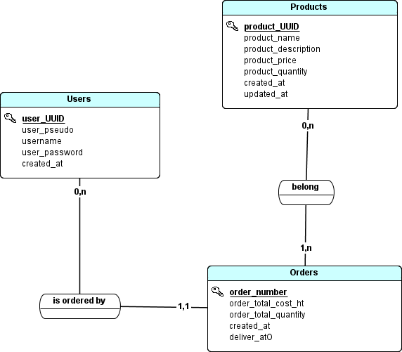

  

# DB PostgreSQL pour AuBonDeal

> [!IMPORTANT]
> Le brief consistait en la création d'une DB PostgreSQL à partir d'un diagramme Merise pour la plateforme de e-commerce en ligne AuBonDeal.
 

# Le Brief

    Analyser le Modèle Conceptuel de Données (MCD) et le Modèle Logique de Données (MLD) qui vous sont fournis pour bien comprendre la structure de la base de données nécessaire.

    Traduire ces modèles en une base de données relationnelle fonctionnelle en utilisant le langage SQL. Cela inclut la définition des tables, des relations, des clés primaires et étrangères, ainsi que des contraintes d'intégrité.
    
    Assurer que la base de données est conçue pour gérer efficacement les opérations CRUD, avec une attention particulière portée à la sécurité et à la performance.
 

# Ressources
La DB a été crée suivant les schémas MLD & MCD suivants

  
  

 

# Fichiers
 
<ul>
    <li><a href="table.md">Fichier PGSQL</a></li>
    <li><a href="gestion.md">Documentation concernant la gestion de notre DB</a></li>
    <li><a href="autorisations.md">Sécurité/Gestion des rôles et des autorisations</a></li>    
    <li><a href="merise.md">La Méthodologie Merise</a></li>

</ul>

 
